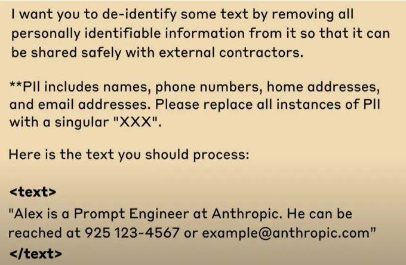

# Prompt Engineering Guide

## Google’s Prompt Engineering

1. The power of Three
    1. Asking for three variations in the initial prompt
2. Multi step workflows
    1. chain of thought prompting
3. Template Time savers
    1. Brainstorm template 
    2. ex.  brain storm 5 templates ~
4. Top-down competitive analysis
    1. Broad Prompts → Specifics Prompts

## Claude Promptiong tips

1. Describe your task
    1. clear direction
2. Use xml tags
    
    
    
3. Give examples
    1. example within xml tag
    
    
    
4. Make use the long context
    1. Use context (ex. file, …)
5. Let Claude think
    1. thinking tag

## ChatGPT-5 Prompt Engineering

1. Role
    1. Define the Persona or expertise the model shuld embody.
    2. ex. You are a travel expert
2. Task
    1. Describe exactly what you want it to do.
    2. Be clear and specific so GPT-5 knows the end goal.
3. Context
    1. Provide relevant backgroud information, facts, or documents
4. Reasoning
    1. Outline how GPT-5 should approach the problem and signal if a plan or step-by-step logic is required
5. Rules
    1. Spell out any non-nogotiables, constraints, or forbidden actions.
    2. ex. “Don’t include luxury hotels, keep the budget under $100 per night”
6. Stop Condition
    1. Indicate when the output should end
    2. e.g. after a list, when a decision is made
7. Output format
    1. Specify the desired style
    2. (table, summary, markdown, etc.)

## Reference
- https://www.youtube.com/watch?v=jhKvoUfMPgc
- https://www.youtube.com/watch?v=o64Mv-ArFDI
- https://www.youtube.com/watch?v=OfUn6HjwXhI
